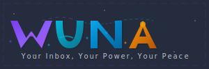

# WunaEmail Logo System

## Overview

The WunaEmail logo system embodies the brand's mystical, gamified approach to email communication. Each logo variant is designed to reflect the core principles of **Wisdom, Understanding, Novelty, and Awakening** while incorporating psychological gamification elements and occult-themed aesthetics.

## Logo Variants

### 1. Animated SVG Logo (`WunaLogo.svg`)
- **Primary logo** with full animation suite
- Floating particles and energy fields
- Mystical glow effects and cosmic background
- Responsive design with scalable vector graphics
- **Use case**: Main branding, landing pages, hero sections

### 2. React Component (`WunaLogo.jsx`)
- **Dynamic logo** with user-specific effects
- Gamification integration with achievement levels
- Real-time animation based on user engagement
- Achievement symbols and level indicators
- **Use case**: Web applications, user dashboards, interactive elements

### 3. Demo Page (`logo-demo.html`)
- **Interactive showcase** of all logo variants
- Live preview with different contexts
- Feature explanations and design philosophy
- Color palette documentation
- **Use case**: Brand presentations, developer documentation

### 4. Integration Guide (`LogoIntegration.js`)
- **Component library** for different use cases
- Header logos, loading states, error states
- Email signature variants
- Achievement celebration logos
- **Use case**: Development integration, consistent branding

## Design Philosophy

### Color Psychology
Each letter in WUNA represents a core principle with its corresponding color:

- **W - Wisdom (Purple/Indigo)**: `#6366F1` to `#8B5CF6`
  - Represents spiritual insight and higher consciousness
  - Creates trust and authority in communication
  - Stimulates creativity and mystical thinking

- **U - Understanding (Cyan/Teal)**: `#0891B2` to `#06B6D4`
  - Symbolizes clarity and emotional intelligence
  - Promotes calm, focused communication
  - Represents the flow of information and empathy

- **N - Novelty (Blue/Cyan)**: `#0EA5E9` to `#0284C7`
  - Represents the discovery of new ideas and innovations
  - Symbolizes the fresh perspective of novel experiences

- **A - Awakening (Gold/Amber)**: `#D97706` to `#F59E0B`
  - Signifies enlightenment and breakthrough moments
  - Creates urgency and importance
  - Represents the "aha" moment in communication

### Gamification Elements

1. **Achievement Integration**: Logo adapts based on user level and achievements
2. **Progressive Unlocking**: Visual effects unlock as users engage more
3. **Mystery Elements**: Hidden symbols and animations for discovery
4. **Energy Systems**: Visual representations of user engagement levels
5. **Social Proof**: Subtle indicators of community participation

### Occult-Themed Aesthetics

1. **Mystical Symbols**: Subtle incorporation of ancient wisdom symbols
2. **Energy Fields**: Animated connections between elements
3. **Cosmic Backgrounds**: Star fields and cosmic particles
4. **Transformation Effects**: Morphing and evolving visual elements
5. **Sacred Geometry**: Hidden geometric patterns and ratios

## Technical Specifications

### SVG Requirements
- **Format**: Scalable Vector Graphics (SVG) 1.1
- **ViewBox**: Optimized for responsive scaling
- **File Size**: Under 50KB for web performance
- **Compatibility**: Works across all modern browsers
- **Accessibility**: Screen reader compatible with proper ARIA labels

### Animation Performance
- **Frame Rate**: 60fps smooth animations
- **CPU Usage**: Minimal impact on device performance
- **Mobile Optimization**: Reduced animations on mobile devices
- **Battery Efficiency**: Respects user preferences for reduced motion

### Color Accessibility
- **Contrast Ratio**: WCAG 2.1 AA compliant
- **Color Blindness**: Tested for protanopia, deuteranopia, tritanopia
- **Dark Mode**: Optimized for both light and dark backgrounds
- **High Contrast**: Supports system high contrast modes

## Usage Guidelines

### Do's
- ✅ Use the appropriate variant for each context
- ✅ Maintain color consistency across applications
- ✅ Scale proportionally without distortion
- ✅ Include proper attribution when required
- ✅ Test across different devices and screen sizes

### Don'ts
- ❌ Modify colors or proportions
- ❌ Remove animations without accessibility alternatives
- ❌ Use in contexts that contradict brand values
- ❌ Overlay on busy backgrounds without proper contrast
- ❌ Stretch or distort the logo proportions

## Integration Examples

### Basic HTML Integration
```html
<!-- Static Logo -->


<!-- Animated Logo -->
<object data="WunaLogo.svg" type="image/svg+xml" width="450" height="150">
  
</object>
```

### React Integration
```jsx
import WunaLogo from './WunaLogo';

function App() {
  return (
    <div>
      <WunaLogo size="large" achievementLevel={5} />
    </div>
  );
}
```

### CSS Background Integration
```css
.wuna-background {
  background-image: url('WunaLogo.svg');
  background-size: contain;
  background-repeat: no-repeat;
  background-position: center;
}
```

## Brand Consistency

The WunaEmail logo system is designed to maintain consistency across all touchpoints while allowing for contextual adaptation. The mystical, gamified approach should be evident in every implementation, creating a cohesive brand experience that resonates with users seeking meaningful, secure communication.

## Support and Updates

For logo updates, new variants, or integration support, refer to the main brand documentation or contact the design team. Regular updates ensure compatibility with new platforms and accessibility standards.